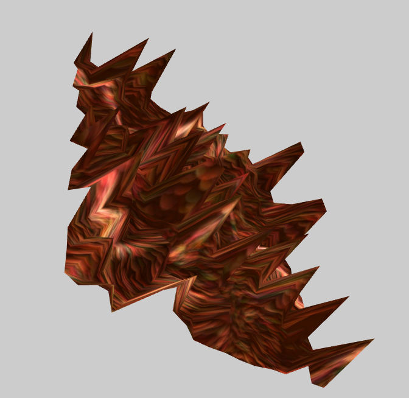

# TP1 Moteur de Jeux

## Usage

### Project setup

> ./reset_dir.sh (supprime l'ancien dossier build et le reconstruit)
>
> cd build; make -j
>
> ./launch-TP1.sh

### Raccourcis

> Z, S : zoom/unzom.

> &#8592;, &#8593;, &#8594;, &#8595; :  translation de la caméra.

> R : rotation de la 3 ème chaise ou du plan texturé.

>**ligne 47 TP1.cpp** ``bool scene_1 = false;
>`` :  modifier à **true** pour afficher le plan texturé.

## Aperçu des scènes

|  |  |
| ----------------------------------------------------- | ----------------------------------------------------- |
|  |  |

