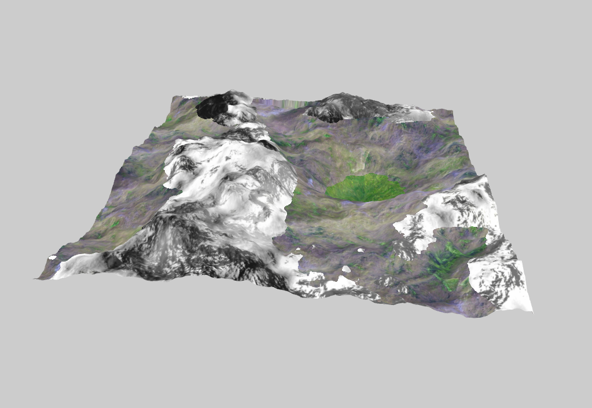
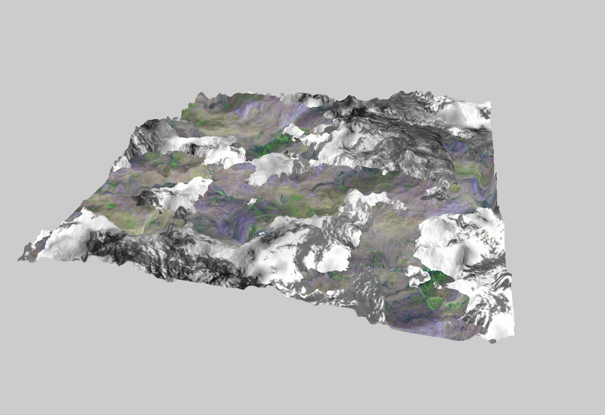
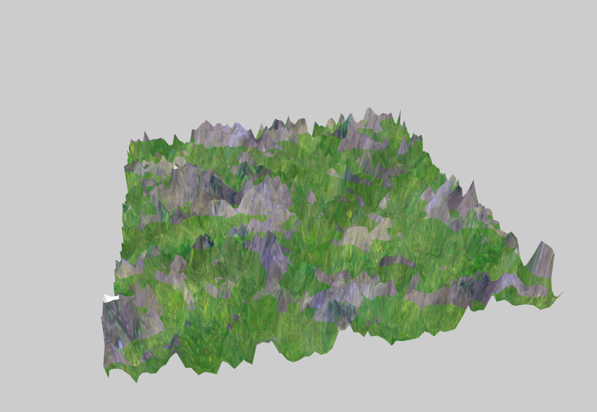

# TP2 Moteur de Jeux

## Usage

> Z,Q,S,D : Déplacement caméra.
> 	caméra libre: avancer, gauche, reculer, droite.
> 	caméra orbitale: déplacements sur le cercle dans le plan $yz$ ou $xy$.
>
> &#8593;, &#8595; :  Contrôle de la vitesse de rotation de la map.
>
> +, - : Augmenter/Diminuer la résolution du terrain. 
>
> c : Changer le mode de la caméra (orbital ou caméra libre).

## Aperçu de la scène

|                      Heightmap_Mountain                      |                       Heightmap_Rocky                        |                     heightmap-1024x1024                      |
| :----------------------------------------------------------: | :----------------------------------------------------------: | :----------------------------------------------------------: |
|  |  |  |

