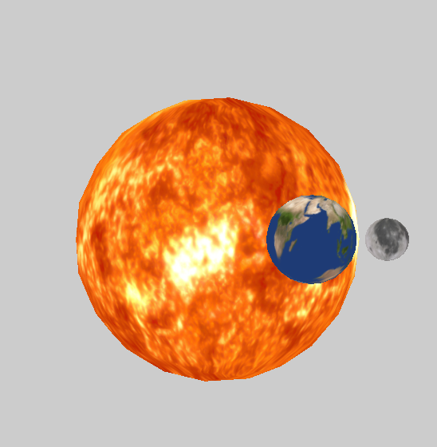

# TP3 Moteur de Jeux

> **USAGE** 
> *z,q,s,d*: Translation de caméra (avant, gauche, arrière, droit).
> *i,j,k,l*: Rotaton de la caméra autour de l'origine (caméra orbitale).
> *&#8593;, &#8595;*: Augmenter/Diminuer la vitesse de rotation.

Le **graphe de scène** a été implémenté au sein de la classe **Entity** dont les noeuds ont chacun un **maillage** et une **transformation**. Chaque noeud possède une liste de noeuds **enfants** et une référence vers son noeud **parent** ainsi après avoir appliqué une transformation à un noeud,  la méthode ``updateSelfAndChild()``  propage les transformations aux noeuds enfants.

Dans **Transform** on combine les transformations dans le sens **scale, rotation puis translation**.
Lors de l'exécution, un affichage des matrices de transformation dans le **repère monde** et en **local** (d'un noeud par rapport à son noeud parent)  de toutes les entités est effectué dans la console.

|       **Système solaire simplifié**        |
| :----------------------------------------: |
|  |

