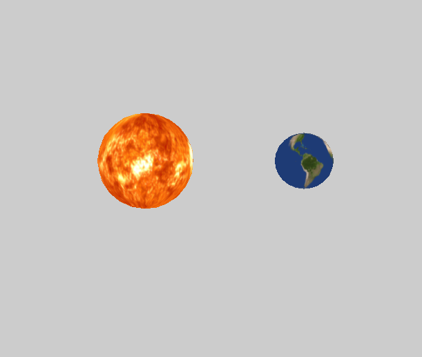

# TP3 Moteur de Jeux

> **USAGE** 
> *z,q,s,d*: mouvement de caméra (avant, gauche, arrière, droit).
> *&#8593;, &#8595;*: Augmenter/Diminuer la vitesse de rotation.

Le **graphe de scène** a été implémenté, dans le code la terre est un noeud enfant du soleil, elle tourne sur elle-même en même temps de tourner **autour du soleil**. Il m'a fallu ajouter une matrice de **self-rotation** propre à chaque noeud en plus d'une matrice **translation-rotation-scale**. 

|     **Système solaire simplifié**      |
| :------------------------------------: |
|  |

