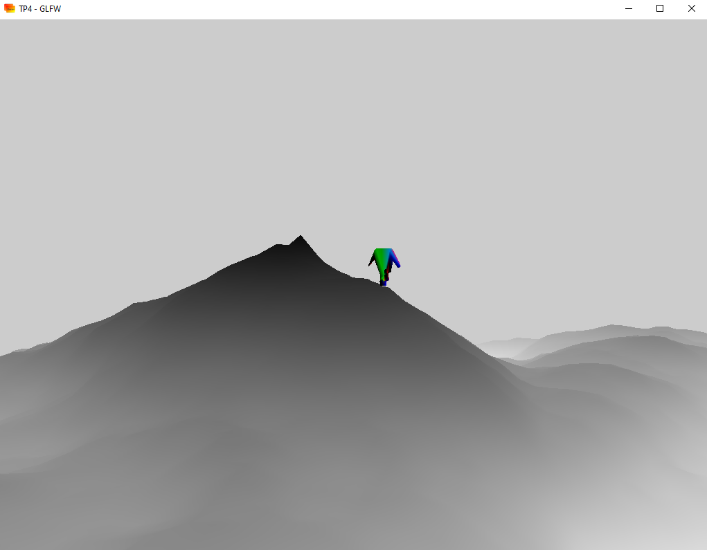
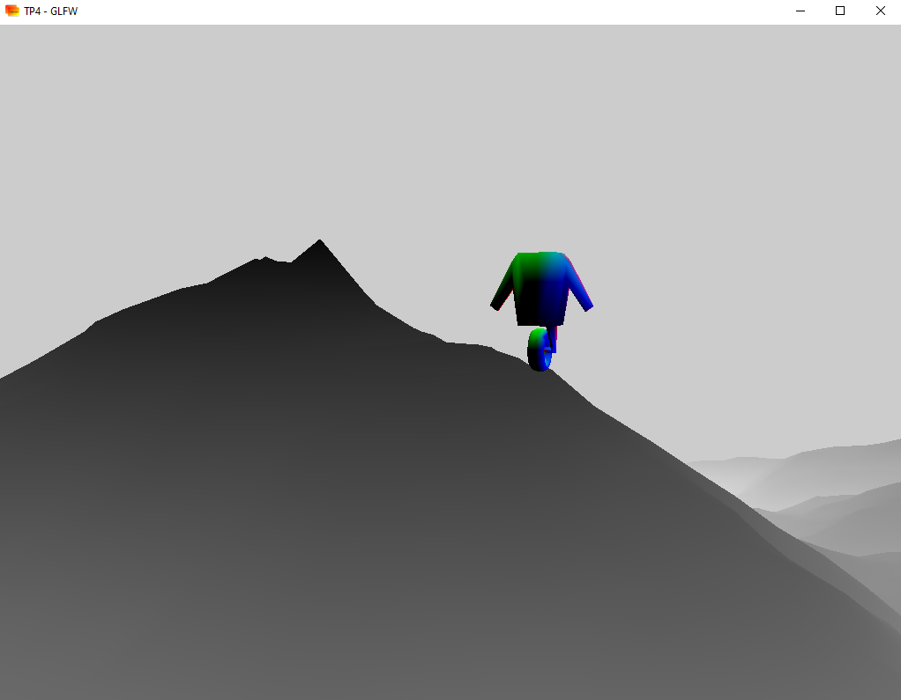
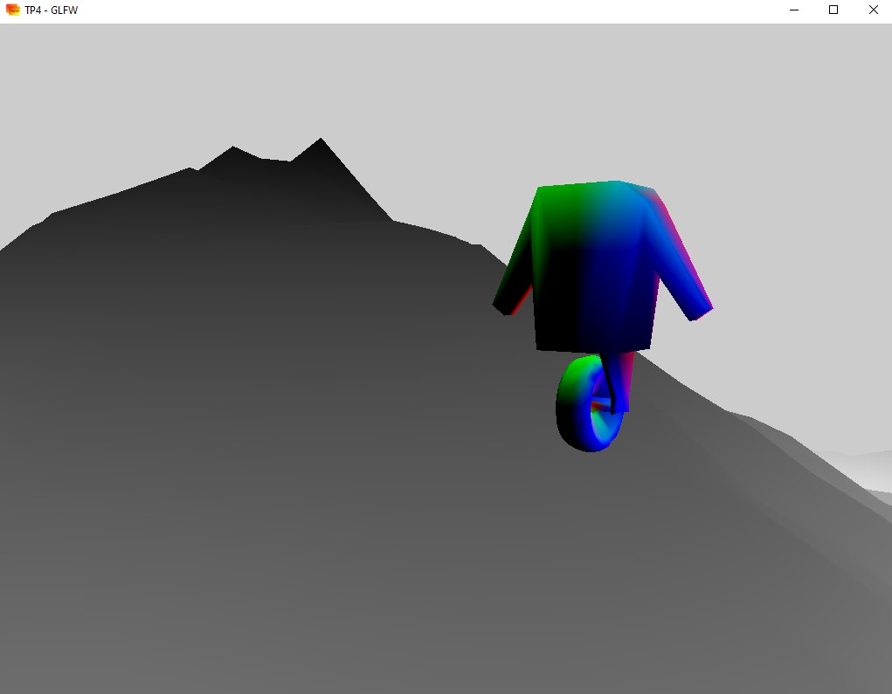
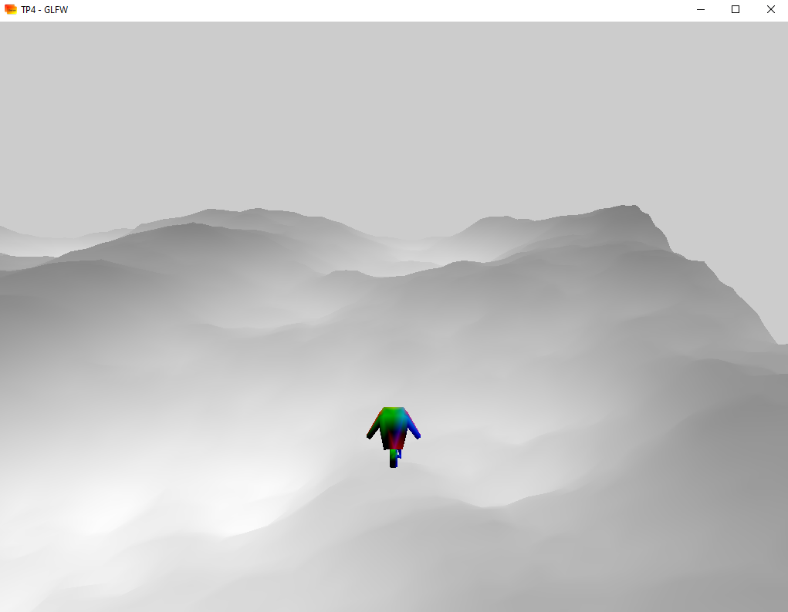

 # TP4 Moteur de Jeux

> **USAGE** 
> *z,q,s,d*: Translation de caméra (Lorsque celle-ci ne suit pas l'objet).
> *i,j,k,l*: Yaw, Pitch (lorsque la caméra ne suit pas l'objet).
> *c* : Changement de caméra.	
> *&#8593;, &#8592;, &#8595;, &#8594;* : Déplacement de l'objet.

*Le maillage utilisé à été **construit sur blender** puis **converti en .OFF sur MeshLab***

## Objet non traversant

Afin de déterminer la **hauteur du terrain en un point donné**, j'ai crée la fonction
 ``bool point_in_triangle(const glm::vec3 p)`` qui renvoie **true** si le point p est **dans le triangle**, false sinon.

Le terrain est obtenu en appliquant une **heightmap** sur un **plan aligné sur les axes X, Z**. Donc l'altitude d'un point du terrain n'est accessible que dans les **shaders** alors après avoir déterminé le triangle sur lequel l'objet est placé, les coordonées **UV** du terrain correspondantes à ce triangle sont envoyées au vertex shader à l'aide de ``glUniform2fv(ball_height_handle, 3, &tri_uvs[0])``.

L 'altitude de l'objet est alors mise à jour dans le **vertex shader**, elle est calculée de la manière suivante:
```c++
sum_height += texture(height_sampler, ball_height_UV[0]).r;
sum_height += texture(height_sampler, ball_height_UV[1]).r;
sum_height += texture(height_sampler, ball_height_UV[2]).r;
sum_height /= 3.;
	.
    .
    .
gl_Position.y  -= amplitude * (offset + sum_height)
```


## Niveaux de détails

Le maillage est chargé à différents niveaux de détails avant la boucle de rendu:
```c++
mesh_lod ball_lod;
ball_lod.low = Mesh::simplify(8, ball);
ball_lod.medium = Mesh::simplify(15, ball);
ball_lod.high = Mesh::simplify(32, ball);
```

J'ai réutilisé la fonction de simplification de maillages avec la **grille de sommets représentants** réalisée au premier semestre en **HAI714I**. Ainsi le maillage de qualité **basse** est obtenu en simplifiant le maillage de base à partir d'une grille 3D de **représentants** de dimensions 8 * 8 * 8 et ainsi de suite pour les maillages de qualité **moyenne** et **haute**.

Lors d'un **mouvement de l'objet** ou de la **caméra**, le maillage de l'objet est alors **mis à jour** et la définition du maillage **diminue lorsque la distance entre la caméra et l'objet augmente**, de la même façon celle-ci augmente lorsque la distance entre la caméra et l'objet diminue.

|        **Objet basse qualité**         |         Objet qualité moyenne          |         Objet haute qualité          |
| :------------------------------------: | :------------------------------------: | :----------------------------------: |
|  |  |  |

|               Caméra libre                |               Caméra 'TPS'               |
| :---------------------------------------: | :--------------------------------------: |
|  |  |

